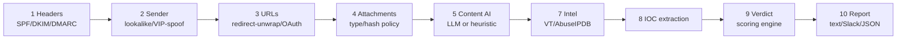

# PDAX Email Security Detection Core — Technical Checkpoint Report

**Project:** PDAX-PROP-SEC-001 — in-house email security platform
**Checkpoint date:** 2026-08-02
**Repo:** `pdax-email-core`
**Audience:** engineering / security team

---

## 1. Concept

PDAX currently relies on Trend Micro Email Security (TMES) as its email
gateway filter. During internal testing, a real phishing email was found that
had already passed through TMES — it carried a `clicktime.trendmicro.com`
URL-rewrite wrapper (proof it was scanned) and was still delivered as
malicious. That single case is the business justification for this project:
**build an in-house detection pipeline PDAX controls end-to-end**, informed
by PDAX's own threat picture rather than a vendor's generic ruleset, with a
path to eventually replace or supplement TMES.

## 2. The plan

The design (captured in three earlier planning documents — Annexes A/B/C,
summarized in `HANDOFF.md`) is a **10-stage, transport-agnostic analysis
pipeline**:



One function, `run_pipeline(raw_bytes, source=...)`, is meant to be called
identically by three different transports, so detection logic is written once:

| Transport | Mode | Status |
|---|---|---|
| CLI (`analyze.py`) | Manual analysis of a `.eml` file | **Built, in use** |
| Gmail-API POC (Annex B) | Post-delivery, monitor-only (label + Slack alert, never blocks) | Not started |
| Postfix+Rspamd gateway (Annex C) | Pre-delivery, can reject/quarantine | Not started (config skeleton exists outside this repo) |

The transport layers are deliberately **last** in the plan — you don't wire a
gateway that can reject real mail until the detection logic underneath it is
trusted.

## 3. Tech stack

- **Language:** Python, constrained to **3.9** (the user's macOS fleet runs
  system Python 3.9 under JumpCloud management — no newer syntax, verified by
  parsing every file with `ast.parse(..., feature_version=(3,9))` as a gate).
- **Schema/validation:** `pydantic` v2 for every data model (`Verdict`,
  `StageResult`, `PipelineResult`, `IOCSet`).
- **Config:** `PyYAML` for `rules/weights.yaml`.
- **Everything else is stdlib** — the offline core runs with zero external
  API calls and only two hard dependencies. This is a deliberate constraint:
  detection logic can be developed and tuned against real `.eml` files with
  no cloud account, no API key, no cost.
- **Optional, pluggable AI backends** (off by default): `boto3` (AWS Bedrock,
  Claude models) and `google-genai` (Google Gemini, AI Studio API key).

## 4. Architecture: the scoring engine

The core design decision is that **the AI stage never decides the verdict.**
A deterministic engine (`app/pipeline/verdict.py`) owns every decision. This
matters for a BSP-regulated VASP: it means a malicious email body cannot talk
an LLM into producing a false CLEAN verdict, because the LLM's output is
structurally incapable of setting the verdict — it can only contribute a
bounded numeric sub-score.

Two mechanisms:

**Hard overrides** — a short list of high-confidence combinations that bypass
weighting entirely (threat-intel hit, lookalike domain, banned attachment,
VIP-name spoof + BEC language co-occurring). These exist because early testing
showed that **averaging buries real signals**: a gift-card BEC email first
scored CLEAN because several unrelated clean stages diluted two strong flags
toward zero.

**Max-plus weighted blend** for everything else — the dominant signal plus a
damped 50% contribution from the rest, not a plain average:

```python
contributions.sort(reverse=True)
if contributions:
    dominant = contributions[0]
    rest = sum(contributions[1:]) * 0.5          # damped reinforcement
    composite = round(min(dominant + rest, 100.0), 1)
```

**Every content/intel provider implements a `typing.Protocol`**, so swapping
in a real LLM or a real threat-intel feed never touches pipeline code:

```python
class ContentProvider(Protocol):
    def analyze(self, subject: str, body: str, context: dict
                ) -> tuple[float, list[str], dict]:
        ...   # (score 0-100, findings[], facts{"provider": name})
```

## 5. What's been built this checkpoint

### 5.1 Real content-AI providers (`app/pipeline/content_ai.py`)

Two production `ContentProvider` implementations, both **off by default**
(gated behind `SEG_CONTENT_PROVIDER=bedrock|gemini`, default `heuristic`),
sharing one system prompt and one pydantic output schema so behavior is
consistent regardless of backend:

- **`BedrockProvider`** — Claude via AWS Bedrock (`ap-southeast-1`). Uses
  Bedrock's Converse API with **forced tool-use** so the model's output is
  always structured JSON, never free text.
- **`GeminiProvider`** — Gemini via the Google AI Studio developer API key.
  Uses `response_mime_type=json` + `response_schema` (Gemini's equivalent
  structured-output mechanism).

Both share the same failure-handling contract: validate with pydantic, retry
**once** with a repair turn on a schema violation, then degrade honestly to a
zero content sub-score (`status=degraded`) rather than raising — a broken or
unreachable AI provider can never crash or block the pipeline.

The shared prompt has an explicit prompt-injection defense: the email body is
framed as untrusted attacker-controlled data, and an attempt to redirect the
model's behavior is itself surfaced as a `prompt_injection_attempt` finding
rather than followed.

**Compliance note (flagged, not silently decided):** the Gemini path is the
Google AI Studio consumer API, not Vertex AI — no region pinning, weaker
data-processing terms. Email content leaves PH jurisdiction to Google's
consumer API surface. **DPO sign-off under RA 10173 (Data Privacy Act) is
required before either off-box provider is pointed at real employee/customer
mail.** Both are implemented and tested but neither has been run against a
real account yet — no credentials were available in this environment.

### 5.2 Real-world validation

Ran the pipeline against two real captured emails, not the synthetic golden
set:

- `samples/agora.eml` — currently CLEAN. Ground truth from the user is still
  **pending** — this is an open item, not a closed one.
- `samples/phish_wooga_esign_oauth_bec.eml` (originally `wooga.eml`) —
  confirmed phishing via an external analyzer's ground-truth writeup
  (ticket INC-260729-045: display-name brand spoof + OAuth consent-phish link
  + an injected, reused legitimate email thread as filter-evasion filler).
  The pipeline initially scored this **LOW (41.2) — a real miss.**

Root-caused and fixed with three new, generalized detection rules (each
verified against the entire existing sample set first to confirm zero false
positives before merging):

```python
# app/pipeline/sender.py — brand impersonation in display name
# "'Kenneth Chua' Via ShareFile Notifications" — sender domain has no
# relationship to ShareFile. Distinct from VIP-name spoof: the borrowed
# trust here is the BRAND's, not an individual's.
for brand, brand_doms in BRAND_DOMAINS.items():
    if re.search(rf"\b{re.escape(brand)}\b", display) and from_dom not in brand_doms:
        flags.append(f"brand_impersonation_display_name:{brand}")
        score += 40
```

```python
# app/pipeline/urls.py — OAuth state-param email exposure
# Fires on a fully legitimate host (login.microsoftonline.com) — the host
# is never the tell. A plaintext victim email in `state` is: legitimate
# apps use an opaque token there, never PII.
if _OAUTH_AUTHORIZE_PATH.search(urlparse(unescaped).path):
    if state_m and _EMAIL_IN_STRING.search(unquote(state_m.group(1))):
        flags.append("url_oauth_state_email_exposure"); score += 35
```

```python
# app/pipeline/content_ai.py — whitespace-padding evasion
# 12+ consecutive blank/whitespace-only lines — hides an injected,
# often-legitimate reused thread beneath the actual lure. All 6
# pre-existing samples cap out at 1-2 consecutive blank lines.
PADDING = re.compile(r"(?:\n[ \t]*){12,}")
```

Plus a body-parsing bug fix: this email's `text/plain` MIME part itself
contained raw, unstripped HTML (a real mailer quirk) — tag-stripping was only
applied on the `html_body()` fallback path. Now applied unconditionally,
which also matters for the LLM providers: markup soup was burning their
context budget on CSS/divs instead of the actual lure text.

**Result: LOW (41.2) → MALICIOUS (100.0).** No regressions. The case is now a
permanent regression sample (`phish_wooga_esign_oauth_bec.eml`), not a
one-off patch.

### 5.3 Secure code review + SAST

Ran both automated and manual review passes:

- **`bandit`** (static analysis, all 18 `.py` files): 2 low-severity findings
  in production code, both benign (`try/except/pass` cleanup patterns, not
  real issues).
- **`pip-audit`** (dependency vulnerabilities): `pydantic` and `PyYAML` — the
  only two hard dependencies — have **zero known vulnerabilities**.
- **Manual trace of attacker-controlled data flows** found one real,
  concrete issue that tooling didn't catch, in `app/report.py`:

  ```python
  _CONTROL_CHARS = re.compile(r"[\x00-\x08\x0b\x0c\x0e-\x1f\x7f]")

  def _sanitize(s: str) -> str:
      """From/Subject are attacker-controlled and MIME-decoded upstream, so
      they can carry raw bytes — including ANSI escape sequences that a
      crafted Subject can use to spoof the printed verdict line in an
      analyst's terminal."""
      s = (s or "").replace("\r", " ").replace("\n", " ")
      return _CONTROL_CHARS.sub("", s)
  ```

  Proved this concretely: a MIME-encoded Subject can decode to raw ANSI
  escape bytes, which `analyze.py` printed straight to the terminal — a
  crafted email could visually spoof the verdict line an analyst is reading
  (CWE-150, terminal escape sequence injection). The same unescaped strings
  fed into Slack's `mrkdwn` formatting meant a Subject like `<!channel>`
  would render as a literal channel-wide ping. Both fixed with `_sanitize()`
  and a matching `_slack_escape()`, applied everywhere those fields reach an
  output surface.

- **Dependency check on the optional AI providers** (not yet installed in
  the project venv, checked in an isolated scratch environment): confirmed
  `google-genai` supports Python 3.9 (`Requires-Python: >=3.9` per its own
  package metadata). Found a structural, not-currently-fixable issue: on
  Python 3.9, `botocore` (a `boto3` dependency) hard-pins
  `urllib3 (<1.27,>=1.25.4)` — confirmed directly from `botocore`'s own
  dependency metadata — and 1.26.20 is the last release ever published in
  that branch. That version carries known CVEs (unbounded HTTP-decompression
  resource exhaustion; a cross-origin redirect header-leak issue). Real-world
  exploitability is low here (it requires a malicious response from the
  Bedrock endpoint itself, a trusted first-party AWS service), but it's a
  genuine, documented constraint of staying on Python 3.9 with `boto3` — not
  something a `pip install --upgrade` can resolve.

## 6. Current status

```
python3 tests/test_core.py                 → 6/6 passed
python3 tests/test_content_ai_bedrock.py   → 5/5 passed
python3 tests/test_content_ai_gemini.py    → 5/5 passed
python3 tests/run_eval.py samples/         → TP=4 FP=0 TN=3 FN=0
                                              precision=1.00 recall=1.00
```

7 golden-set samples (grew from 6 this checkpoint with the confirmed
`wooga` phishing case). ~1,500 lines of Python across 18 files.

## 7. Open items

1. **`agora.eml` ground truth** — still unconfirmed by the user. It's
   currently scored CLEAN because its TrendMicro-wrapped redirect resolves
   back to the sender's own domain (the same pattern legitimate trackers
   use) — need a verdict before treating that as correct or as a miss.
2. **Real `IntelClient`** (VirusTotal/AbuseIPDB) — still a stub
   (`LocalIOCClient`, scores 0 on every email). This is the single
   highest-leverage remaining gap: an intel hit is a hard override, so
   wiring it immediately upgrades detection.
3. **DPO sign-off under RA 10173** — required before `GeminiProvider`
   (Google AI Studio) touches real mail. `BedrockProvider` has an in-region
   story but hasn't been run against a real AWS account either.
4. **Neither LLM provider has been tested against a real API yet.**
5. Enrichment stages 3/4/6 (live URL redirect-follow, attachment deep-parse,
   visual/brand comparison) remain static/unbuilt, per the original design's
   own prioritization (detection trust before enrichment cost).
