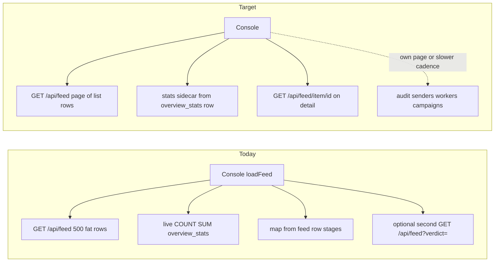
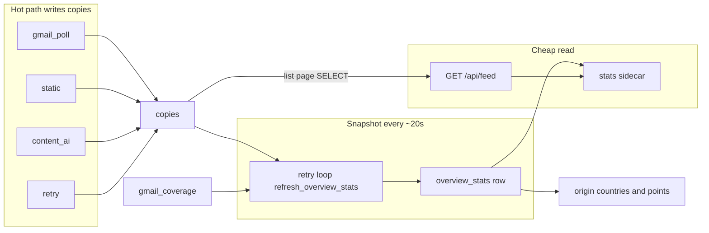

# Make the API a cheap read path

Status: **plan only**.
Owner: SEGS API / web console.
Related: workers write `copies`; API should SELECT. Overview tiles and the origin map are worker-written snapshots in Aurora/SQLite — not DynamoDB, not live COUNT on `GET /api/feed`.

---

## Overview

Keep the API a cheap read layer over worker-written `copies`. Stop the console from over-fetching, slim list payloads, remove leftover pipeline work from request handlers, and **precompute Overview totals + origin-map aggregates** so `GET /api/feed` is a page SELECT plus a one-row snapshot lookup.

The architecture already matches this: Gmail poll → static → content AI → follow-ups write `copies` (and related stores). [`docs/architecture.md`](../docs/architecture.md) is explicit: *workers write; the API reads*. Live mail is **not** re-scored on `GET /api/feed`.

What feels slow is the **fetch surface**, not the worker pipeline. Console extras (audit/senders/workers/campaigns) are already page-gated in [`loadFeed()`](../web-console/src/lib/dashboard.ts). Remaining pain:

- 500-row fat feed (stages + body excerpts)
- dual filtered + unfiltered GETs when a tile is selected
- polling `/api/feed` on every route
- live [`overview_stats()`](../backend/stores/assessments.py) COUNT/SUM on every feed request
- Overview map assembled from `state.feed` rows (`collectOriginPoints`), so pins wait on the fat GET and are clipped to the page



---

## Todos

- [ ] Snapshot table + compute/read/write; API `overview_stats()` SELECTs the row (90s stale fallback). Include quarantined, inbox, and origin map aggregates.
- [ ] Call `refresh_overview_stats()` from the retry worker 20s loop; add verdict/ai, pending, and origin indexes.
- [ ] Denormalize origin country/lat/lon on `copies`; snapshot `origin.countries` and `origin.points`; Overview map paints from `stats.origin` on first feed JSON. Add `?origin=` for click-to-filter.
- [ ] Split `loadFeed` poll: feed-only on Overview/queue; page-specific fetches for workers/audit/senders/campaigns; drop duplicate filtered+unfiltered feed; 4s only on Overview/Queue while AI pending.
- [ ] List vs item DTO; default feed page to 100 + thread siblings; omit body/stages from list; stop `SELECT *` on `list_feed`.
- [ ] Stop `force=True` from clearing sample cache; gate samples in prod; enqueue reevaluate instead of sync `run_pipeline`.
- [ ] Update feed API and console tests; verify Overview poll is one small `GET /api/feed` and the map does not scan rows.

---

## Why fetches are expensive today

**Console over-fetch** in [`web-console/src/lib/dashboard.ts`](../web-console/src/lib/dashboard.ts) `loadFeed()`: the table pages at 100 (`FEED_PAGE_SIZE`); the server still returns **500** copies plus thread siblings, each with stages + body excerpts (`primaryContent` / `quotedContent` / `footerContent`) from [`_ui_from_copy`](../backend/api/feed_builder.py). [`ConsoleContext.tsx`](../web-console/src/context/ConsoleContext.tsx) repeats `loadFeed` every **4s** while AI is pending, **5s** on Workers, **15s** otherwise — including on Settings/Detail.

When an overview tile is selected, the client also fetches **unfiltered + filtered** feed.

**API still does worker work on some paths**

- Sample corpus: [`run_samples()`](../backend/api/feed_builder.py) calls `run_pipeline` per `.eml` at boot and whenever `build_feed(force=True)` clears `_sample_cache`. Release / keep-blocked / retry-ai / reevaluate all pass `force=True`.
- `POST /api/quarantine/{id}/reevaluate` runs a full pipeline **in the request**.
- `POST /api/analyze/eml` is intentionally heavy (upload analysis). Leave it out of this work unless you want it queued too.
- `GET /api/workers` HTTP-probes every split worker (Workers page only, after the existing page-gate).

**DB read shape**

- [`list_feed`](../backend/stores/assessments.py) is `SELECT *` (includes `stages_json` / `meta_json`) capped at 500, then sibling expansion.
- [`overview_stats()`](../backend/stores/assessments.py) runs extra COUNT/SUM scans on every feed request (20s in-process cache only). Indexes exist on `updated_at` and `status`, not on `(ai_done, verdict, updated_at)`.
- Overview map: [`collectOriginPoints()`](../web-console/src/lib/dashboard.ts) scans `state.feed` and reads `stages.origin_ip`. Pins wait for the fat GET and only cover the current page.

---

## Architecture (worker-written snapshot)

Do **not** increment counters inside `gmail_poll` / `static` / `content_ai`. Those workers already contend on `copies`; per-write deltas drift (retries, fan-out, timed_out). Follow the campaign pattern: workers write facts; a singleton loop recomputes derived state.



Inbox tiles already have a store: [`gmail_coverage.snapshot()`](../backend/stores/gmail_coverage.py) (written by poll). Bake those four inbox fields into the same snapshot so `_feed_payload` does not join coverage on every request.

---

## Where to store (not DynamoDB)

**Keep the snapshot in the existing SQL data plane** — Aurora Postgres in prod (`SEG_DATABASE_URL`), SQLite in pytest/local. Same place as `copies`, `campaigns`, `gmail_coverage`, `runtime_settings`, and `worker_heartbeats`.

DynamoDB is **not** a better store for this:

- The payload is **one row** of aggregate counts (plus a small `hourly[]` array and origin buckets), not mail bodies. It is not a sensitivity/PII problem that Dynamo would solve; RA 10173 already keeps mail on Aurora + KMS.
- The worker that *computes* the snapshot must scan `copies` in Postgres. Writing the result next to that table is one connection, one backup, one IAM story. Dynamo would add a second data plane for a small JSON blob.
- `GET /api/feed` already opens Postgres for the list page. A PK lookup of `overview_stats` is cheaper than COUNT/SUM and cheaper than a second AWS API (Dynamo + IAM + VPC endpoint/NAT + Terraform table).
- This repo does not use Dynamo for application data. The only mention is a **commented** Terraform state lock table in [`infra/versions.tf`](../infra/versions.tf). Campaigns, sender risk, and coverage already follow “derived row in SQL.”
- Local/CI has no Dynamo. A Dynamo snapshot would mean a prod-only code path or a fake dual store — the opposite of how [`backend/db.py`](../backend/db.py) works today.

When Dynamo *would* make sense later: millions of independent readers, or a snapshot that must survive Aurora being down while the console still shows tiles. Neither is the Overview poll problem.

**Do not** reuse `runtime_settings` (that table is operator switches like Gmail fetch pause). A dedicated one-row `overview_stats` table keeps derived telemetry separate from admin config.

---

## Plan (do in this order)

### 1. Snapshot table + store (API becomes SELECT)

Add `overview_stats` (one row, key `all`) in [`backend/schema.sql`](../backend/schema.sql) and the SQLite twin in [`backend/stores/assessments.py`](../backend/stores/assessments.py):

- `key TEXT PRIMARY KEY`
- `payload_json TEXT`
- `computed_at DOUBLE PRECISION`

Keep the existing SQL in `compute_overview_stats()` (today’s four queries). Extend it with:

- `quarantined` — `UPPER(disposition) = 'QUARANTINE'`
- `held` — same as quarantined unless spool `bucket` is already stored; do not invent a second source of truth
- inbox fields from `coverage_snapshot()` at refresh time
- `origin` — see section 3

`overview_stats()` on the API path becomes: **read the snapshot**. If missing or older than ~90s (local/dev, retry down), compute once and write (fail-open: `empty_overview_stats()` on error). Drop the 20s in-process cache; the row is the cache.

JSON shape stays compatible with [`FeedOverviewStats`](../web-console/src/types.ts) (`total`, `pending`, `inconclusive`, `clean` / `low` / `suspicious` / `malicious`, `aiPendingTotal`, `aiTimedOutTotal`, `hourly[]`, `feedLimit`, inbox fields). Add `quarantined` / `held` / `computedAt` / `origin` as additive fields.

### 2. Refresh from the retry worker (no new Fargate task)

[`workers/retry.py`](../workers/retry.py) already runs a singleton 20s loop (`desired_count = 1` in [`infra/workers.tf`](../infra/workers.tf)). Call `refresh_overview_stats()` each cycle **even when** `inconclusive_retry` is off.

- Extract compute/write into `backend/stores/overview.py` (or keep next to `overview_stats` in assessments) so pytest does not need the worker process.
- Heartbeat `stats` on the cycle (`total`, `pending`, `computed_at`) so the Workers page can show snapshot age.
- No new ECS service, SQS queue, or `WORKERS` name. Do not put this on `campaign` (that task already rewrites `campaigns`).

Indexes — they make the **worker** scan cheap:

- `idx_copies_feed` on `(updated_at DESC)` covering list (already close; ensure Postgres uses it).
- `idx_copies_verdict_ai` on `(ai_done, verdict, updated_at)` for tiles and `?verdict=` filters.
- `idx_copies_pending` on `(ai_done, status)` for pending/timeout counts.
- `idx_copies_origin` on `(origin_country)` after denormalize (map filter + rollup).

### 3. Overview map from the same snapshot (do not wait on feed rows)

Today [`collectOriginPoints()`](../web-console/src/lib/dashboard.ts) scans `state.feed` and reads `stages.origin_ip` per row. The map therefore:

- stays empty until the fat `GET /api/feed` returns
- only shows origins on the current page (500 today, 100 after the list DTO shrinks)
- fights the slim-list goal (`_ui_from_copy` already has `_LIST_ORIGIN_KEYS` / `slim` to keep country on list rows)

**Paint the map from `stats.origin` on the first feed JSON**, same sidecar as the tiles. Do not keep full `stages` on list rows just to draw pins.

**Denormalize on write (static worker / `upsert_copy` when `stages_json` is stored):**

- `origin_country`, `origin_city`, `origin_lat`, `origin_lon` on `copies` (empty until origin_ip enrichment ran)
- Refresh copies these into the snapshot with GROUP BY country and rounded lat/lon (same `toFixed(1)` bucketing the client uses today)

**Snapshot `origin` shape** (no per-message `ids` — that would bloat JSON):

```json
{
  "located": 1200,
  "countries": [
    { "country": "PH", "name": "Philippines", "count": 800, "worst": "LOW", "lat": 12.9, "lon": 121.8 }
  ],
  "points": [
    { "lat": 14.6, "lon": 121.0, "country": "PH", "name": "Philippines", "city": "Makati", "count": 40, "worst": "SUSPICIOUS" }
  ]
}
```

Cap `points` to the top ~200 by count so the sidecar stays small. Country list is small (ISO codes).

**Console:** [`renderOriginMap`](../web-console/src/pages/Overview.tsx) / `collectOriginPoints` prefer `state.feedStats.origin`. Fall back to `collectOriginFromEmails(state.feed)` only when `origin` is missing (old API / tests). Detail map is unchanged — it still uses the item DTO’s `origin_ip`.

**Click-to-filter:** once map counts are unclipped, client-side `feedMatchesOrigin` on the page is a lie (map says 800 PH, table shows 12). Add `GET /api/feed?origin=PH` (and keep `?verdict=`) so the table query matches the map. List rows do not need `stages.origin_ip` for the Overview map.

Do **not** speed this up by calling ip-api/RDAP from the API. Geo stays on the static worker’s origin_ip stage; the snapshot only aggregates what is already on `copies`.

### 4. Console: fetch less, less often

Change `loadFeed()` so the poll loop only refreshes what the current page needs:

- Overview / queue: `GET /api/feed` only (plus `?verdict=` / `?origin=` **instead of** a second unfiltered fetch).
- Workers page: `/api/workers` on its own 5s timer; do not bundle it into every feed poll.
- Audit, sender-profiles, campaigns: load on those pages, or at a slower cadence (e.g. 60s), not every 4s.
- Detail: keep using [`GET /api/feed/item/{id}`](../backend/api/routers/feed.py); do not rebuild the 500-row feed to show one thread. Do not poll `/api/feed` on Settings/Detail.

Keep the 4s interval only while `aiPendingTotal > 0` **and** the user is on Overview/Queue.

### 5. Slim list payloads; keep detail fat

Split the UI row into **list** vs **item**:

- List fields: id, ts, verdict, score, from/to/subject, pipelineStatus, AI flags, threadKey/count, mailbox, short `aiSummary`.
- Omit from list: `primaryContent`, `quotedContent`, `footerContent`, full `stages`, IOCs, fanout lists. Do not keep `stages.origin_ip` on list just to draw the Overview map (snapshot owns that). Detail and Analyze already have the full shape via `/api/feed/item/{id}`.

Align the server page with the UI: add `limit` (default 100) and keep thread-sibling expansion **for that page only** (existing `_with_thread_siblings`). Drop `FEED_LIST_LIMIT = 500` as the default response size.

For list queries, select the columns the list DTO needs instead of `SELECT *`. Keep `SELECT *` (or stages/meta) for `/api/feed/item/{id}`.

Wire `overview_stats` as the always-on sidecar in the feed JSON (tiles + map need totals beyond the page). That is a **row SELECT**, not a COUNT scan.

Optional later (not required for the first pass): `If-None-Match` / `since=updated_at` so a quiet poll returns 304 or a small delta. Only worth it after list payloads are slim.

### 6. Stop the API from re-running the pipeline on fetch/mutate

- `force=True` should invalidate the **live spool cache** only, not `_sample_cache`. Triage actions must not re-score the sample corpus.
- Gate sample corpus with a setting (e.g. `SEG_DASHBOARD_SAMPLES`, default off when `SEG_DATABASE_URL` is set). Production feed = `copies` SELECT only.
- `reevaluate`: enqueue a static (or dedicated) worker job and return 202 + current row, same as `retry-ai`. Do not `run_pipeline` on the API thread.

Leave `POST /api/analyze/eml` as a sync deep-analysis endpoint (that is its job).

### 7. Tests and verification

- Snapshot write/read: worker refresh then `overview_stats()` is a SELECT; totals and origin aggregates are unclipped vs feed limit ([`test_assessments.py`](../backend/tests/pipeline/test_assessments.py)).
- Stale/missing snapshot: one compute fallback, then subsequent reads hit the row.
- Additive `quarantined` and `origin` fields; existing tile fields unchanged.
- [`backend/tests/server/test_feed_api.py`](../backend/tests/server/test_feed_api.py): list payload has no body excerpts and no full stages; item still has them; `?origin=` filters; `force` refresh does not call `run_samples`; filtered feed is one query path.
- [`web-console/src/lib/dashboard-model.test.ts`](../web-console/src/lib/dashboard-model.test.ts) and e2e: poll does not request workers/audit/campaigns on Overview; map uses `feedStats.origin` without scanning rows.
- Manual: Overview poll should stay a single `/api/feed` with a small JSON body; map pins appear from `stats.origin` without waiting on 500 fat rows; opening a message hits `/api/feed/item/{id}`.

---

## Out of scope

- WebSockets / SSE (polling a slim feed is enough).
- Making Analyze async.
- Moving profile/campaign/sender-risk loops out of the API process ([`main.py` lifespan](../backend/api/main.py) still starts them). Worth a follow-up if the API task CPU is high, but it is not the console fetch problem.
- Per-copy counter increments in hot workers.
- Extra Overview tile unless Quarantine later switches to `stats.quarantined`.
- Live geo lookup on GET. Detail origin map stays item-scoped.
- DynamoDB (or any second data plane) for the snapshot.
