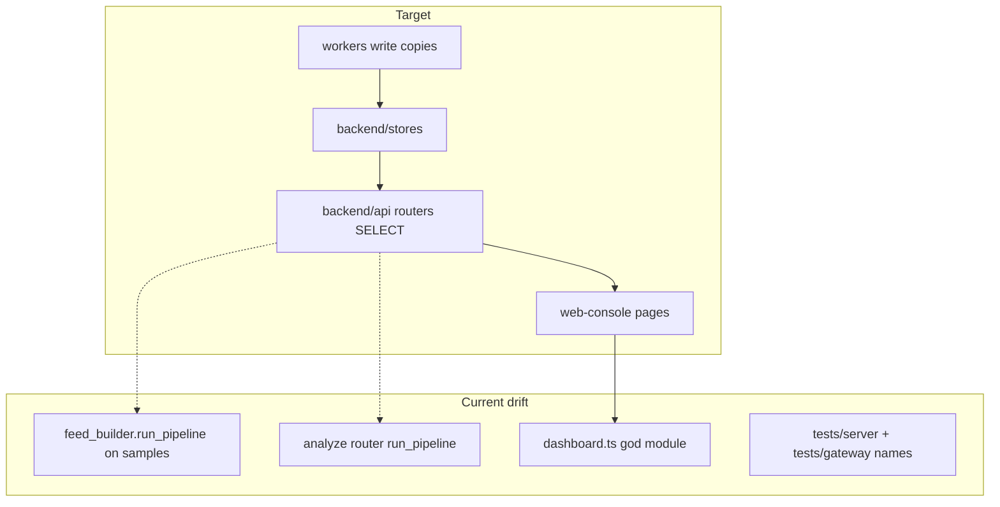

# Folder structure assessment — backend, workers, web console

Status: **assessment** (Python fullstack + FE engineer dual pass).
Owner: SEGS maintainers.
Related: `instructions.md`, `README.md` layout, `plan/efficient-api-fetches.md`, `plan/folder-structure-remediation.md`.

---

## Overview

The **target** layout in `README.md` is the right one: `backend/` (API + stores), `workers/` (one process per job + `pipeline/`), `web-console/` (Vite SPA), `infra/` (Terraform). Git root is the application root. That split matches how production runs (Fargate API vs split worker tasks vs CloudFront/S3).

The **current** trees are mid-reorg. The packages exist and are installable (`pyproject.toml` includes `backend*`, `workers*`, `cli`), but names, leftover dirs, and a 7.4k-line console engine still describe an older `app/` + `server/` + `gateway/` + pre-React dashboard.

This note is structure only. Detection quality, scoring, and ClamAV are out of scope (see `plan/clamav-attachment-scanning.md`).



---

## What is already right

- **Three runtimes, three trees.** API, workers, and console are not one monolith process.
- **Stores vs routers.** `backend/stores/` is the persistence boundary; workers upsert, most list/get paths live there.
- **Worker entrypoints.** `python -m workers <name>` with a closed `WORKERS` tuple in `workers/__init__.py` staying lazy so `:8766` can bind before Vertex/Gmail.
- **Pipeline isolation.** Stages live under `workers/pipeline/`; `verdict.py` is the sole verdict owner.
- **Console routing.** `src/App.tsx` + `pages/` + `components/` + `context/` is a real React app, not leftover HTML.
- **Terraform is split by concern** (`vpc.tf`, `ecs.tf`, `workers.tf`, `sqs.tf`, `cloudfront.tf`, …) rather than one 4k-line file.
- **Tests collect from one place** (`backend/tests`, `pytest` `testpaths`).

---

## Backend (`backend/`)

### Current shape

| Path | Role | Notes |
|------|------|--------|
| `config.py` `db.py` `paths.py` `schema.sql` | Shared runtime | Correct home |
| `models.py` `parsed_email.py` `disposition.py` `report.py` `notify.py` `domainutils.py` | Domain used by API **and** workers | Fine as shared kernel; not an “API-only” package |
| `api/main.py` | FastAPI factory + SPA mount | Small and clear (~199 lines) |
| `api/routers/` | HTTP | One module per area; `__init__.py` empty (OK) |
| `api/feed_builder.py` | ViewModel | **926 lines**; still runs `run_pipeline` on the sample corpus |
| `api/security.py` `auth_store.py` `tokens.py` `deps.py` | Auth | Correct layer |
| `stores/` | Persistence | 16 modules; `__init__.py` only re-exports **assessments** |
| `tests/pipeline/` | Pipeline + worker unit tests | Lives under backend, not `workers/tests/` |
| `tests/server/` | API tests | **Name leftover** from the old `server` package |
| `tests/gateway/` | Gmail poll tests | **Name leftover**; code is `workers.gmail_poll` |
| `tests/tools/` `tests/eval/` | CLI + golden set | Correct |

### Findings

**Critical**

- None for folder layout itself. The API process must not *start* Gmail/LLM workers; that invariant is documented and `main.py` does not launch them.

**Should fix**

1. **Leftover package names in tests.** `tests/server/` and `tests/gateway/` teach the wrong map. New contributors look for `server/` at repo root. Rename to `tests/api/` and fold gmail-poll tests into `tests/pipeline/` or `tests/workers/`. `conftest.py` still comments `server.auth_store`.
2. **API still executes the pipeline.** `feed_builder.py` (sample corpus at boot / `force=True`) and `routers/analyze.py` call `run_pipeline`. List/feed GET should stay SELECT-only (`plan/efficient-api-fetches.md`). Analyze-on-upload can stay heavy if it is explicitly queued, not mixed into feed assembly.
3. **`stores/__init__.py` is a partial facade.** It imports only assessments. Either re-export the stores the API uses or stop implying a package API — today’s pattern is `from backend.stores import foo`, which is fine; the incomplete `__init__` is the smell.
4. **View vs ViewModel clutter.** `api/` mixes HTTP (`routers/`), JSON assembly (`feed_builder.py`, `nl_search.py`), and side channels (`wazuh_shipper.py`, `activity_log.py`). Not wrong for this size, but `feed_builder.py` should not grow further; split list vs item DTO there rather than adding more pipeline calls.
5. **`.gitignore` comments are stale.** They still mention `gateway/spool/` and `backend/pipeline/` (pipeline moved to `workers/pipeline/`).

**Nit**

- Shared kernel files at `backend/*.py` are a flat grab-bag. A later `backend/core/` is optional; do not move them until import churn is worth it.
- `requirements.txt` still exists beside `pyproject.toml` + `uv.lock` — two dependency stories.

---

## Workers (`workers/`)

### Current shape

**Job entrypoints** (`python -m workers <name>`):  
`gmail_poll`, `static`, `content_ai`, `thread_ai`, `retry`, `campaign`, `sender`, `profile`, `sender_risk`, `receiver`.

**Support (not in `WORKERS`):** `gmail.py`, `sqs.py`, `jobs.py`, `runtime.py`, `health.py`, `followup.py`, `copy_jobs.py`, `stage_run.py`, `gmail_llm.py`.

**Stages:** `pipeline/*.py` — headers, sender, urls, deception, attachments, intel, content_ai, verdict, plus libraries (`rdap_client`, `landing_fetch`, `url_forensics`, `attachment_forensics`, `origin_ip`, `deep_analysis`, `request_class`, `stage_summary`, `correlation`, `policy`, `detection_rules`, `sandbox`).

### Findings

**Should fix**

1. **Name collisions.** `workers/sender.py` (job) vs `workers/pipeline/sender.py` (stage). Same for `content_ai.py`. Imports must use the full module path. This is the highest ongoing confusion cost in the Python tree.
2. **Compat shims.** `gmail_llm.py` only re-exports `workers.content_ai`. Call sites (e.g. `backend/api/routers/feed.py`) should import `workers.content_ai` and drop the shim.
3. **Two queue stories.** `jobs.py` `KINDS` is `static | content_ai | thread_ai | intel`. Production is SQS (`infra/sqs.tf`) with campaign/profile/etc. `followup.py`’s docstring still says follow-up jobs “live in the API process”. Docs and module comments should match SQS + split containers.
4. **Stage vs library files in `pipeline/`.** Forensics, RDAP, landing fetch, and sandbox are not first-class `run_pipeline` stage names in the same way as headers/sender/urls. They can stay, but a one-line map in `pipeline/__init__.py` (stage `run()` vs helpers) would stop people adding a new “stage” file that is never wired.
5. **Empty leftover `gateway/`.** Repo root still has `gateway/spool/` (gitignored mail dir). Architecture says there is no `gateway/` package. Remove the directory once spool data is irrelevant locally.

**Nit**

- `receiver` as all-in-one is documented and useful locally. Keep it; do not add new work there.
- `profile` / `sender_risk` aliases vs combined `sender` job: keep aliases for tests, document in `__main__.py` (already started).

---

## Web console (`web-console/`)

### Current shape

```
web-console/src/
  App.tsx                 routes — good
  pages/                 14 screens + colocated tests
  components/            Layout, Sidebar, modals, ui.tsx
  context/ConsoleContext.tsx
  lib/api.ts             same-origin fetch — good
  lib/dashboard.ts       7464 lines, @ts-nocheck
  lib/*.ts               a few focused helpers (search, dwell, workers-status)
  types.ts               DTOs — good start
  test/                  harness
e2e/                    Playwright
```

Pages are real React components, but they still **reach through** `dashboard.ts` for model, HTML strings, charts, maps, and `loadFeed()`. `ConsoleContext` polls that engine globally (4s / 5s / 15s), including on Settings and Detail.

### Findings

**Critical**

- None that are purely structural. XSS/auth depend on how `dashboard.ts` still injects HTML; that is a code-quality risk amplified by the god module, not a missing folder.

**Should fix**

1. **`src/lib/dashboard.ts` is the real structure problem.** `@ts-nocheck`, `var` / `any`, string-HTML painters, mutable `state`, Chart/map side effects, and fetch live in one file. New features keep landing there. Until it is split, `pages/` is a thin shell.
2. **No feature modules.** Everything is `pages/` + `lib/`. That is acceptable at this size **if** `dashboard.ts` is broken up. Do not add `src/features/` as empty ceremony; extract by topic (`verdicts`, `feed`, `charts`, `maps`, `quarantine-actions`).
3. **Global poll vs page-scoped data.** Structure cannot fix over-fetch by itself, but the folder plan and `plan/efficient-api-fetches.md` are the same work: Overview should not own workers/audit/senders/campaigns.
4. **Vendored `public/chart.umd.min.js` + CSS-in-JSVectormap imports** from the engine. Charts/maps belong behind a `lib/charts.ts` / `lib/origin-map.ts` so pages do not import the whole engine.
5. **Tests are shallow relative to pages.** Several `*.test.tsx` files are ~22–27 lines (smoke render). Fine as a start; they will not protect a dashboard split unless moved toward the extracted modules.

**Nit**

- `pages/ConsoleLayout.tsx` vs `components/Layout.tsx` — two “layout” names. Rename only with the fetch/context change.
- Settings split across `/settings`, `/settings/organization`, `notifications`, `users` is fine; no extra `pages/settings/` folder required yet.

---

## Terraform (both agents)

`infra/` is a **single-stack** layout (not Terraform modules). That is reasonable for one VPC / one env.

**Should fix**

- Remote state in `versions.tf` is still commented (local state). Flag on every infra change; do not enable without an explicit bucket/table.
- `network.tf` is mostly security groups (name drift vs `vpc.tf`).
- `ecs.tf` (API) vs `workers.tf` is the right split; keep worker names aligned with `workers/__main__.py`.
- Duplicate scripts: `deploy/push-images.sh` vs `infra/scripts/push-images.sh`. Pick `infra/scripts/` as the apply path; leave `deploy/docker/` as image sources.
- `.gitignore` already ignores `infra/.bin/` — good; never commit a Terraform binary.

---

## Leftover reorg (repo root)

Working tree (2026-08-30): no `app/`, `server/`, or nested `Email Security Solutions/` directory. `gateway/` remains as an empty spool parent.

Git history / this branch may still be deleting the nested copy. Finish that delete; do not resurrect those packages.

`.gitignore` still documents `gateway/spool/` and `backend/pipeline/` — update when the rename PR lands.

---

## Severity summary

| ID | Area | Finding | Severity |
|----|------|---------|----------|
| B1 | backend tests | `tests/server` + `tests/gateway` leftover names | Should fix |
| B2 | backend api | `feed_builder` / analyze still run the pipeline | Should fix (see fetch plan) |
| B3 | backend stores | Partial `stores/__init__.py` | Nit |
| W1 | workers | Job vs stage filename collisions | Should fix |
| W2 | workers | `gmail_llm.py` shim | Should fix |
| W3 | workers | SQLite `jobs.KINDS` vs SQS graph / stale followup docstring | Should fix |
| W4 | root | Empty `gateway/` | Nit |
| F1 | console | `dashboard.ts` god module + `@ts-nocheck` | Should fix (largest FE cost) |
| F2 | console | Global `loadFeed` in context | Should fix (fetch plan) |
| T1 | infra | Local TF state; script duplication | Should fix |
| D1 | gitignore / docs | Stale `server`/`gateway`/`app` paths | Nit |

Target architecture is sound. Remediation is **naming, leftover dirs, shrinking the console engine, and keeping the API a read path** — not another rewrite of the three top-level packages.

See [folder-structure-remediation.md](folder-structure-remediation.md) for ordered PRs.
