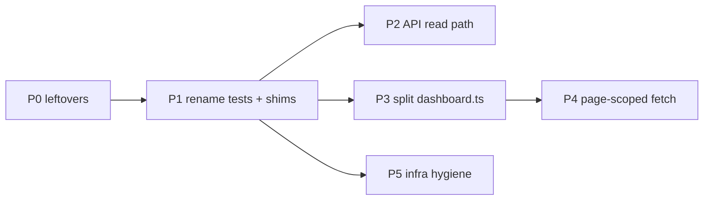

# Folder structure remediation

Status: **plan only**.
Owner: SEGS Python fullstack + FE engineer (write + review each PR).
Related: [folder-structure-assessment.md](folder-structure-assessment.md), [efficient-api-fetches.md](efficient-api-fetches.md).

---

## Goal

Make the **existing** `backend/` / `workers/` / `web-console/` split match what the code and ECS tasks actually are: leftover names gone, job vs stage files obvious, console engine split so pages own UI, API stays a cheap read path.

Do **not** introduce a fourth top-level Python package. Do **not** move pipeline back under `backend/`. Do **not** add `src/features/` as empty folders.



Each PR: implement, then review the same diff (Python fullstack and/or FE skill). Detection/eval changes stay out of these PRs so FP=0 is not at risk.

---

## Todos

- [ ] **P0** — Remove empty `gateway/`; fix `.gitignore` comments; confirm nested `Email Security Solutions/` is gone
- [ ] **P1** — Rename `backend/tests/server` → `tests/api`; move `tests/gateway` into `tests/pipeline` or `tests/workers`; delete `workers/gmail_llm.py` shim
- [ ] **P2** — Stop `run_pipeline` on feed assembly; list vs item DTO (`efficient-api-fetches.md` items 2–3)
- [ ] **P3** — Split `dashboard.ts` into typed `src/lib/*` modules; ban new `@ts-nocheck`
- [ ] **P4** — Page-scoped `loadFeed` (fetch plan item 1)
- [ ] **P5** — Document or enable TF remote state; single push-images path; keep worker names = `__main__.py`

---

## P0 — Leftovers (small, first)

**Python fullstack.**

1. Delete `gateway/` if it only holds an empty/gitignored `spool/`. Spool is `email/spool/` (`SEG_QUARANTINE_ROOT`).
2. Update `.gitignore`: drop `gateway/spool/` and the `backend/pipeline/` comment; keep `email/spool/` and `data/`.
3. Grep for `from app.`, `from server.`, `from gateway.` at repo root (exclude `docs/archive/`). Should be zero.
4. Confirm no `app/` or `server/` packages remain on the branch that organizes the repo.

**Done when:** `ls` at git root has no `app/`, `server/`, `gateway/`; pytest still collects the same tests.

---

## P1 — Names and shims

**Python fullstack.** Import-only / path-only. No behavior change.

### Tests

| Today | After |
|-------|--------|
| `backend/tests/server/` | `backend/tests/api/` |
| `backend/tests/gateway/` | `backend/tests/pipeline/` (gmail poll) **or** `backend/tests/workers/` if you add that folder for job tests only |

Update `conftest.py` comments (`server.auth_store` → `backend.api.auth_store`). Do not change pytest `testpaths` (`backend/tests` still works).

### Workers

- Replace `from workers.gmail_llm import …` with `from workers.content_ai import …`.
- Delete `workers/gmail_llm.py`.
- At the top of `workers/sender.py` and `workers/content_ai.py`, one-line docstring: “Job entrypoint, not `pipeline.sender` / `pipeline.content_ai`.”

Optional later (own PR): `workers/jobs.py` `KINDS` comment pointing at `infra/sqs.tf`; rewrite `followup.py` module docstring (follow-ups are worker/SQS, not the API process).

**Done when:** `uv run pytest` + 3.9 parse gate; no remaining `gmail_llm` imports.

**Review:** no accidental import of `workers.pipeline.sender` from the job module; ALB health still does not import Vertex in `workers/__init__.py`.

---

## P2 — API stays a read path

**Python fullstack.** Coordinate with [efficient-api-fetches.md](efficient-api-fetches.md) items 2–4.

1. `GET /api/feed` / `list_feed`: SELECT + JSON; no `run_pipeline`.
2. Sample corpus: do not call `run_pipeline` from `build_feed(force=True)` on analyst actions. Gate samples in prod; enqueue reevaluate instead of in-request pipeline where that plan already says so.
3. `POST /api/analyze/eml` may remain heavy; keep it out of the feed builder.
4. If `stores/__init__.py` stays, either re-export the modules routers use or reduce it to a docstring-only package.

**Done when:** feed tests prove list handlers do not import/run the runner; `uv run pytest` `backend/tests/server` (or `tests/api`).

**Review:** OpenAPI (`python -m backend.api.openapi`) if list vs item DTO changes; `infra/openapi.yaml` stays in sync.

---

## P3 — Split `web-console/src/lib/dashboard.ts`

**FE engineer.** Largest console PR; can be several stacked PRs. Behavior freeze: same routes, same verdict chips, same quarantine actions.

Extract **out** of `dashboard.ts` (do not add new code into it):

| Slice | Suggested file | Consumers |
|-------|----------------|----------|
| Verdict model, labels, stage order | `lib/verdicts.ts` | Overview, Detail, Quarantine |
| `state` + feed helpers | `lib/feed-state.ts` | Context, Overview |
| `api` wrappers already in `api.ts` | keep / extend `lib/api.ts` | all |
| Charts | `lib/charts.ts` | Overview |
| Origin map | `lib/origin-map.ts` | Overview, Detail |
| HTML builders still required | `lib/email-html.ts` | Detail only |
| Quarantine / release / reevaluate | `lib/quarantine-actions.ts` | Detail, Quarantine |
| Workers tiles | already partly `lib/workers-status.ts` | Workers page |

Rules for each slice:

- No `@ts-nocheck` on **new** files. Type `state` incrementally; `unknown` + narrow beats `any`.
- Pages import the slice, not `dashboard.ts`, once a symbol has moved.
- Move unit tests next to the slice (`verdicts.test.ts`, etc.).
- Stop when `dashboard.ts` is only a re-export barrel **or** under ~500 lines of leftovers. Then delete the barrel.

**Done when:** `npm run typecheck` and `npm test` pass; Overview/Detail still render; no new symbols added to `dashboard.ts` in later PRs.

**Review:** XSS on From/Subject (keep `escapeHtml`); no extra fetch introduced; `vite` proxy unchanged.

---

## P4 — Page-scoped fetching

**FE engineer**, after or with P3 enough that `loadFeed` is not a 7k-line function. Execute [efficient-api-fetches.md](efficient-api-fetches.md) §1.

- Overview / queue: `GET /api/feed` only.
- Workers: own timer.
- Audit / senders / campaigns: those pages or 60s cadence.
- Detail: `GET /api/feed/item/{id}` only.
- 4s poll only while `aiPendingTotal > 0` **and** Overview/Queue.

**Done when:** a test or documented trace shows Overview poll is one small feed GET.

**Review:** Settings and Detail do not hammer `/api/workers` and `/api/campaigns`.

---

## P5 — Terraform hygiene

**Both agents** on `infra/`.

1. Do not apply. Document in `infra/README.md` that state is local until S3 backend is uncommented (user must create bucket/table).
2. Treat `infra/scripts/push-images.sh` as the canonical push; `deploy/push-images.sh` should be a thin wrapper or deleted after README links are updated.
3. Any new worker name: `__main__.py` + `infra/workers.tf` + health path + console Workers page in the **same** PR.
4. Console route / cookie changes: `cloudfront.tf` + `waf.tf` reviewed in the same turn as the UI change.

**Done when:** worker list in TF matches `WORKERS` (minus test-only aliases); README does not point at two push scripts.

**Review:** no secrets in tf; digest pins; no second ALB hostname.

---

## Out of scope (do not do in this plan)

- Moving `backend/tests/pipeline` to `workers/tests/` (pytest is configured; churn > benefit).
- `backend/core/` package for models/parsed_email.
- Terraform modules (`modules/vpc`) unless a second environment appears.
- Rewriting the console to a new framework.
- Enabling fail-closed, reject-on-malicious, or new default network enrichments.

---

## Suggested PR order

1. P0 + P1 (structure, safe).
2. P5 can land anytime it does not wait on console work.
3. P3 in 2–4 stacked PRs (verdicts/feed first, charts/maps last).
4. P2 + P4 together or P2 then P4 so the console does not assume fat feed rows.

---

## Definition of done (whole plan)

```bash
uv run pytest
uv run python backend/tests/eval/run_eval.py samples/corpus/
uv run ruff check backend workers cli
# 3.9 parse gate from instructions.md

cd web-console && npm run typecheck && npm test && npm run build
```

Repo root matches `README.md` layout; no `app/` `server/` `gateway/` packages; `dashboard.ts` no longer the default place for new UI; feed GET does not run the pipeline.
